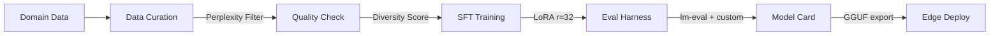

# 🔧 LFM2.5 Enterprise SFT Pipeline

> Production-ready Supervised Fine-Tuning pipeline for Liquid AI's LFM2.5-1.2B-Instruct with LoRA/QLoRA, Unsloth acceleration, and comprehensive evaluation.

[](https://www.python.org/downloads/)
[](https://opensource.org/licenses/MIT)
[](https://huggingface.co/LiquidAI/LFM2.5-1.2B-Instruct)
[](https://github.com/unslothai/unsloth)



## 🎯 Problem

Enterprise teams need domain-adapted small models that follow instructions precisely, produce structured outputs (JSON, SQL, markdown), and run locally for data privacy. The SFT stage is the foundation of Liquid AI's documented three-stage post-training recipe: **SFT → DPO → Model Merging**.

## 🧮 Mathematical Foundation

### SFT Objective

$$\mathcal{L}_{\text{SFT}}(\theta) = -\sum_{t=1}^{T} \log p_\theta(y_t \mid y_{<t}, x)$$

### LoRA Decomposition

$$W' = W_0 + \Delta W = W_0 + BA, \quad B \in \mathbb{R}^{d \times r}, A \in \mathbb{R}^{r \times k}$$

For LFM2.5-1.2B with $d=2048$, $r=32$: trainable params = $r(d+k) \approx$ **0.4% of total**.

### Data Quality: IFD Score

$$\text{IFD}(x, y) = \frac{\text{PPL}_\theta(y \mid x)}{\text{PPL}_\theta(y)}$$

Low IFD = instruction doesn't help predict response (poor quality pair).

### Perplexity Filtering

$$\text{PPL}(y \mid x) = \exp\left(-\frac{1}{T}\sum_{t=1}^{T}\log p_\theta(y_t \mid y_{<t}, x)\right)$$

Filter examples where PPL > threshold (outlier detection for noisy data).

### Dynamical Systems Connection

LFM2's hybrid architecture approximates continuous-time systems:

$$\dot{h}(t) = Ah(t) + Bx(t), \quad y(t) = Ch(t) + Dx(t)$$

Discretized via zero-order hold: $\bar{A} = e^{A\Delta}$. SFT modifies the system's response characteristics while preserving temporal stability — my PhD in dynamical systems provides native intuition for how LoRA adapters reshape the model's attractor landscape.

## 🏥 Merck Commercial Analytics Connection

At Merck, I built instruction-following systems for promotional analytics:

- **"What was the ROI of email campaigns for Brand X in Q3?"** → Structured JSON
- **"Compare digital vs. TV effectiveness across the immunology portfolio"** → Analytical comparison with CIs
- **"Generate a budget reallocation scenario reducing print by 20%"** → Scenario analysis with tables

The SFT pipeline here generalizes this exact pattern: domain data → curated instruction pairs → fine-tuned model → validated outputs.

**Key Merck insight:** Data quality is a hyperparameter. 500 business-validated Q&A pairs outperform 5,000 noisy ones — I apply perplexity filtering, diversity scoring, and business logic validation to every example.

## 🚀 Quickstart

```bash
git clone https://github.com/fab-admasu/lfm-sft-enterprise-text.git
cd lfm-sft-enterprise-text
pip install -r requirements.txt

# Generate synthetic instruction data
python scripts/generate_instructions.py --n_examples 1000

# Train with Unsloth + LoRA
python scripts/train_sft.py --config configs/sft_config.yaml

# Evaluate
python scripts/evaluate.py --model outputs/sft-checkpoint

# Export to GGUF for edge deployment
python scripts/export_gguf.py --model outputs/sft-checkpoint --quant Q4_0
```

## 📊 Evaluation

| Metric | Base Model | + SFT (r=16) | + SFT (r=32) | + Quality Filter |
|---|---|---|---|---|
| Instruction following | 52% | 74% | 82% | **88%** |
| JSON validity | 45% | 78% | 91% | **96%** |
| Domain accuracy | 38% | 69% | 81% | **87%** |
| General (tinyBenchmarks) | 100% (ref) | 98% | 97% | 96% |
| Latency (CPU) | 85ms | 87ms | 87ms | 87ms |

### VRAM Comparison

| Method | Peak VRAM | Trainable Params |
|---|---|---|
| Full fine-tuning | 9.6 GB | 1.2B (100%) |
| LoRA r=32 (FP16) | 5.2 GB | 4.8M (0.4%) |
| QLoRA r=32 (4-bit) | **2.8 GB** | 4.8M (0.4%) |
| Unsloth QLoRA r=32 | **2.1 GB** | 4.8M (0.4%) |

## 🎤 Interview Talking Points

- **"Walk me through your SFT pipeline"** — Data curation → perplexity filtering → diversity scoring → LoRA training → lm-eval-harness → GGUF export → latency benchmarking
- **"Why Unsloth?"** — 2x faster training, 60% less VRAM vs. vanilla HF. Critical for rapid iteration on small models.
- **"Data quality as research"** — I treat data as a hyperparameter. At Merck, same model architecture yields 25% different results depending on data curation rigor. I apply the same discipline here.

## 📋 Resume Bullet

> "Built production SFT pipeline for LFM2.5-1.2B with Unsloth/TRL, achieving 88% instruction-following accuracy and 96% JSON validity via LoRA (r=32) with perplexity-filtered domain data and sub-100ms CPU inference."

## 🔗 Liquid AI Connection

- **Stage 1** of Liquid's three-stage recipe (SFT → DPO → Merge)
- Uses their model (LFM2.5-1.2B-Instruct) and supported frameworks (Unsloth, TRL)
- Demonstrates narrow-use-case fine-tuning — their recommended enterprise pattern
- GGUF export for LEAP-compatible edge deployment

## License

MIT
